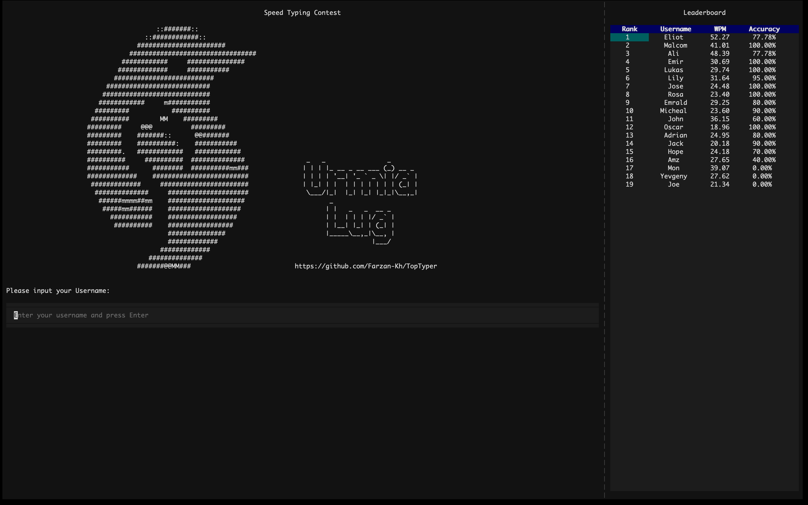

# Speed Typing Contest

Welcome to the Speed Typing Contest project! This application allows users to participate in a typing contest where they can test their typing speed and accuracy.
This script was originally created as a fun activity for a contest/break for Urmia LUG attendees. I decided to share it here.



## Project Structure

```
speed-typing-contest
├── src
│   ├── main.py          # Entry point of the application
│   ├── db.py            # Database management
│   ├── game.py          # Typing contest logic
│   ├── utils.py         # Utility functions
│   └── models
│       └── player.py    # Player model
├── resources
│   ├── db               # Database files
│   ├── styles           # CSS styles for the application
│   ├── words            # Word list for generating typing samples
│   └── banner.txt       # ASCII banner displayed in the app
├── requirements.txt      # Project dependencies
└── README.md             # Project documentation
```

## Installation

1. Clone the repository:
   ```
   git clone https://github.com/Farzan-Kh/topTyper
   ```
2. Navigate to the project directory:
   ```
   cd topTyper
   ```
3. Install the required dependencies:
   ```
   pip install -r requirements.txt
   ```

## Usage

1. Run the application:
   ```
   python src/main.py
   ```
2. Follow the prompts to:
   - Enter your username.
   - Complete the typing contest.
   - View your performance statistics (Words Per Minute and Accuracy).

## Features

- **User Input**: Enter your username to participate.
- **Typing Contest**: Type the provided text as quickly and accurately as possible.
- **Performance Evaluation**:
  - Words Per Minute (WPM) calculation based on correct words.
  - Accuracy percentage based on typed text.
- **Leaderboard**: View the top performers sorted by WPM.

## File Details

- **`src/main.py`**: The entry point of the application.
- **`src/db.py`**: Handles database operations such as saving and fetching player records.
- **`src/game.py`**: Implements the typing contest logic and user interface using the Textual framework.
- **`src/utils.py`**: Provides utility functions for WPM and accuracy calculations.
- **`resources/words/words.txt`**: Contains a list of words used to generate typing samples.
- **`resources/styles/styles.css`**: Defines the CSS styles for the application interface.
- **`resources/banner.txt`**: Displays an ASCII banner at the start of the application.

## License

This project is licensed under the MIT License. See the LICENSE file for more details.

## Acknowledgments

- Built using the [Textual](https://github.com/Textualize/textual) framework for creating terminal-based user interfaces.
- ASCII art generated using [https://patorjk.com/software/taag/](https://patorjk.com/software/taag/).